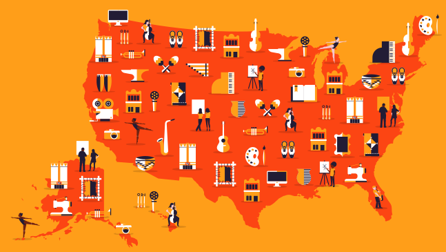

# nea50

This is a simple site that implements a cookie based display of a full-screen jQuery Modal Dialog. When any non-cookied user visits any page where the following code is triggered a modal will appear.

```
(function($) {
  nea50.ui.init($);
  $(document).ready(function() {
    $( "#dialog" ).dialog({
      dialogClass: '50th-splash',
      autoOpen: false,
      width: 'auto',
      height: $(window).height(),
      modal: true,
      position: {
        my: 'left top',
        at: 'left top',
        of: window
      },
      draggable: false
    });
    nea50.modal.resize();
  });
})(jQuery)
```

Place the following HTML within the site footer:

```
<div id="dialog" title="Dialog Title">
  <div class="row-1">
    <div class="dialog-content-wrapper">
      <div class="col-1 splash-map"></div>
      <div class="col-2">
        <a href="/inner.html" class="top-cta"><div class="cta-content"></div></a>
      </div>
    </div>
  </div>
  <div class="row-2">
    <div class="dialog-content-wrapper">
      <div class="col-1"></div>
      <div class="col-2">
        <a href="/inner.html" class="bottom-cta"><div class="cta-content"></div></a>
      </div>
    </div>
  </div>
</div>
```
Note: The href values are temporary placeholder values and will need to be updated.
Note: The image src values will need to be mapped to the correct filesystem values.

To trigger the modal and cookie code, place the /js/init.js file in the appropriate location on the filesystem and link to it somewhere on the Drupal rendered page.
